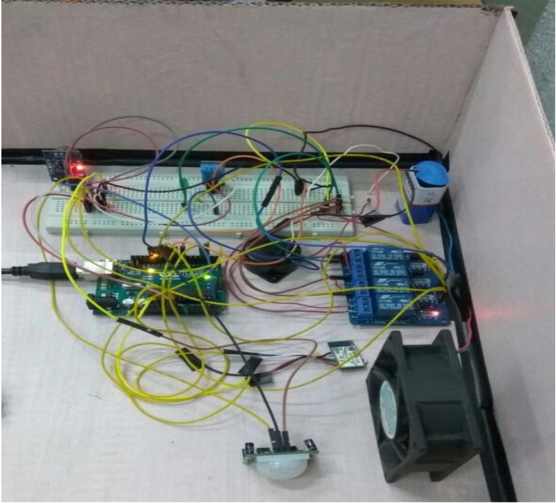
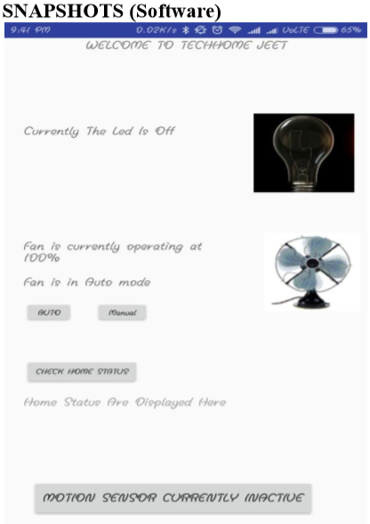
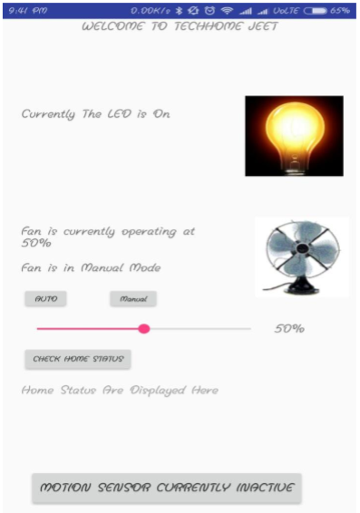
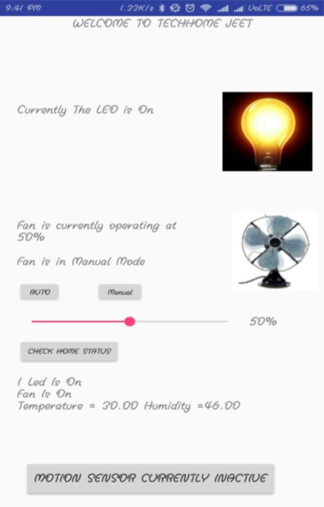

# Home Autimation
## Abstract
This project is a combination of Android mobile technology and embedded system. User cancontrol Home appliances using Android mobile. An application should be installed on user’s Android mobile handset to control various home appliances. Wireless controlling technique used in this project is Bluetooth technology. The microcontroller used is an Arduino uno board.

## The objectives of this project include: 
* construction of a wireless home automation system controlled by a android Smartphone 
* implementation of cost effective and efficient system. 
* designing  a user friendly and a safe system to control home appliances 
* aid the elderly and handicapped users.

## Features of this project:
* 2 types of fan speed modes(automatic and manual).
* In automatic mode fan speed is controlled using Temperature module.
* In manual mode fan speed is controlled manually using using the android phone (there are 5 possible values 0%,25%,50%,75% & 100%).
* The temperature and humidity sensor will give realtime temperature and humidity of the surrounding.
* Option to switch Bulb On & Off.
* Buzzer goes Off along with exit lights powering up and all appliances shuts down if any smoke is detected and a notification is seen on Android phone and as an when smoke is extinguished the buzzer stops along with exit lights switching Off  and a new notification is displayed that "Smoke has been Extinguished " automatically.
* Get live status of the appliances that are currently active.
* A "Secure Home" option that will switch off all appliances and activate the motion sensor which will start sensing for any intrusion activity and if detected then buzzer is started and notification is sent to the Android.
* Since there are so many appliances connected to arduino and the input of it is only max 9V hence I used a relay board which is connected to and external power source to give power to fan,exit lights,buzzer. 

## Components Needed:
  * Arduiuno Uno
  * Bread  Board. 
  * Android phone. 
  * Bluetooth module (RN-42). 
  * Android application. (to control the Arduino via Bluetooth). 
  * Smoke detector 
  * Temperature  sensor  
  * Buzzer 
  * Motion Sensor 
  * Jumping Wires. 
  * Relays Module. 
  * LED lights. 
  * CPU Fan.
  
 ## System Design 
 
There are two types of communication involved in this project: wired and wireless communication. The communication between the Bluetooth module, or RN-42, and the Android based mobile phone will help connect to the controller wirelessly. In contrast, wired communication is the communication between the controller and the appliances. 

## Getting started
### Appliance Part
```
First of all collect all the above mentioned components and make sure everything is wroking by conducting individual testing.
Then note down the password of buletooth module (it is usually 0000 or 1234).
```
### Lets start connecting the hardwares together.
 * There are analog and digital ports in Ardino.<br>
 * Annotation A1,A2,A3 means that I am referring to the 1st,2nd,3rd signal of the Analog signal.
 * I'll be only explaining the connections other than positive and negative .
 * Make sure that all the power and ground inputs are connected to Arduino's 5V and GND respectively(Except for RN-42 which should be connected to 3V).
 ##### Smoke Sensor
 * The data signal of Smoke sensor goes in A5 pin.
 #### Motion Sensor
 * The data signal of Motion  sensor goes in 12 pin.
#### RN-42(Bluetooth Module)
* The Rx pin in digital pin 3.
* The Tx pin in digital pin 2.
#### Temperature Sensor 
*  The data signal of Motion  Temperature goes in 7 pin.
#### Relay Board and (Exiting lights buzzer and fan)
* Connect all the appliances to relay board and give it an external power source of 9V batter.
* Then connect the relay board to Arduino with power and ground to 5V and GND respectively and the input of each channel to the digital pin of arduino.
### Lets connect the Android to Arduino
#### Authenticating
* Since I hosted a server in my local machine hence authentication would not work on your machine.
* You need to according to you machine's IP address update the IP address in config.java file and change the variable "URL_CHECK"
#### Connecting to bluetooth module
* Make sure that you have already paired with the bluetooth module before launching the app.
* Then select your bluetooth module from the list of already paired devices.
* After connection is successful you should be able to control the appliances.
## Outputs Screenshots
### Hardware 

 ### Android App





<br>

For any queries please contact at: shravannambiar@gmail.com
